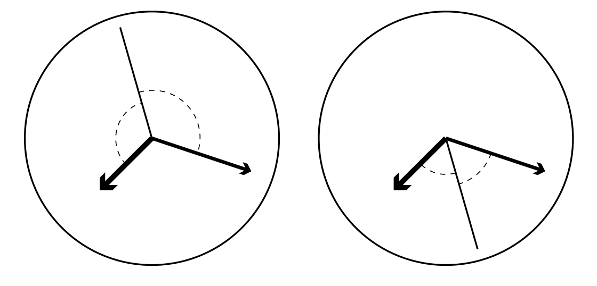
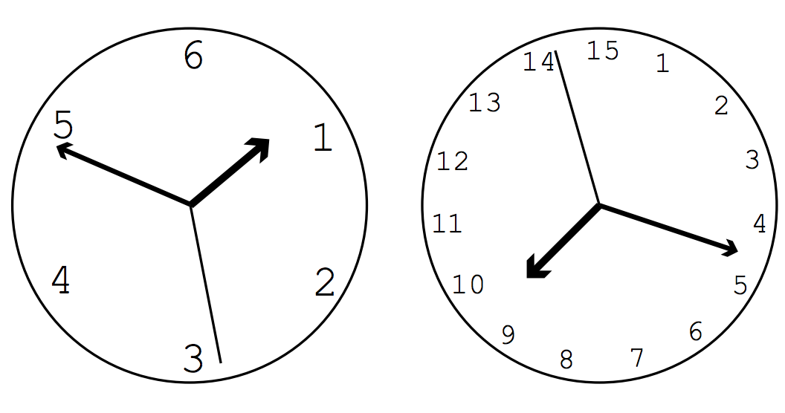

## 문제

We have an analog clock whose three hands (the second hand, the minute hand and the hour hand) rotate quite smoothly. You can measure two angles between the second hand and two other hands.

Write a program to find the time at which “No two hands overlap each other” and “Two angles between the second hand and two other hands are equal” for the first time on or after a given time.

Figure D.1. Angles between the second hand and two other hands

Clocks are not limited to 12-hour clocks. The hour hand of an H-hour clock goes around once in H hours. The minute hand still goes around once every hour, and the second hand goes around once every minute. At 0:0:0 (midnight), all the hands are at the upright position.

## 입력

The input consists of multiple datasets. Each of the dataset has four integers H, h, m and s in one line, separated by a space. H means that the clock is an H-hour clock. h, m and s mean hour, minute and second of the specified time, respectively.

You may assume 2 ≤ H ≤ 100, 0 ≤ h < H, 0 ≤ m < 60, and 0 ≤ s < 60.

The end of the input is indicated by a line containing four zeros.

Figure D.2. Examples of H-hour clock (6-hour clock and 15-hour clock)

## 출력

Output the time T at which “No two hands overlap each other” and “Two angles between the second hand and two other hands are equal” for the first time on and after the specified time.

For T being ho:mo:so (so seconds past mo minutes past ho o’clock), output four non-negative integers ho, mo, n, and d in one line, separated by a space, where n/d is the irreducible fraction representing so. For integer so including 0, let d be 1.

The time should be expressed in the remainder of H hours. In other words, one second after (H − 1):59:59 is 0:0:0, not H:0:0.
