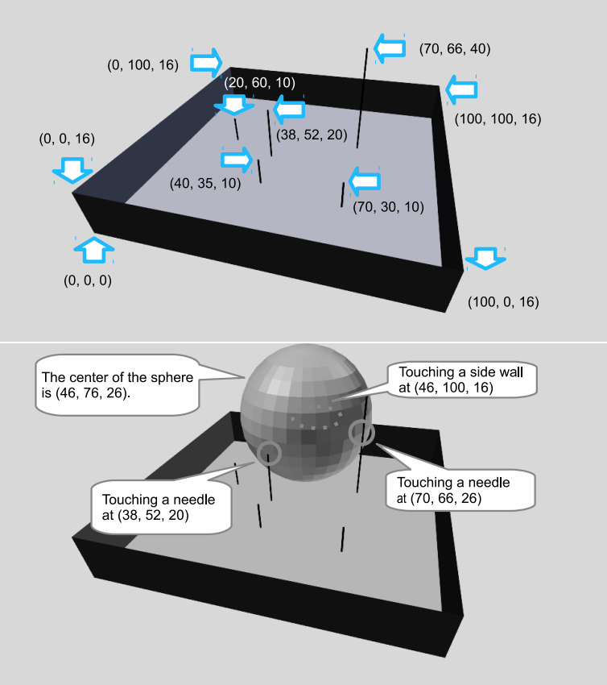

## 문제

An open-top box having a square bottom is placed on the floor. You see a number of needles vertically planted on its bottom.

You want to place a largest possible spheric balloon touching the box bottom, interfering with none of the side walls nor the needles.

Java Specific: Submitted Java programs may not use “java.awt.geom.Area”. You may use it for your debugging purposes.

Figure H.1 shows an example of a box with needles and the corresponding largest spheric balloon. It corresponds to the first dataset of the sample input below.

## 입력

The input is a sequence of datasets. Each dataset is formatted as follows.

```

n w
x1 y1 h1
.
.
.
xn yn hn
```

The first line of a dataset contains two positive integers, n and w, separated by a space. n represents the number of needles, and w represents the height of the side walls.

The bottom of the box is a 100 × 100 square. The corners of the bottom face are placed at positions (0, 0, 0), (0, 100, 0), (100, 100, 0), and (100, 0, 0).

Each of the n lines following the first line contains three integers, xi, yi, and hi. (xi, yi, 0) and hi represent the base position and the height of the i-th needle. No two needles stand at the same position.

You can assume that 1 ≤ n ≤ 10, 10 ≤ w ≤ 200, 0 < xi < 100, 0 < yi < 100 and 1 ≤ hi ≤ 200. You can ignore the thicknesses of the needles and the walls.

The end of the input is indicated by a line of two zeros. The number of datasets does not exceed 1000.



Figure H.1. The upper shows an example layout and the lower shows the largest spheric balloon that can be placed.

## 출력

For each dataset, output a single line containing the maximum radius of a balloon that can touch the bottom of the box without interfering with the side walls or the needles. The output should not contain an error greater than 0.0001.
