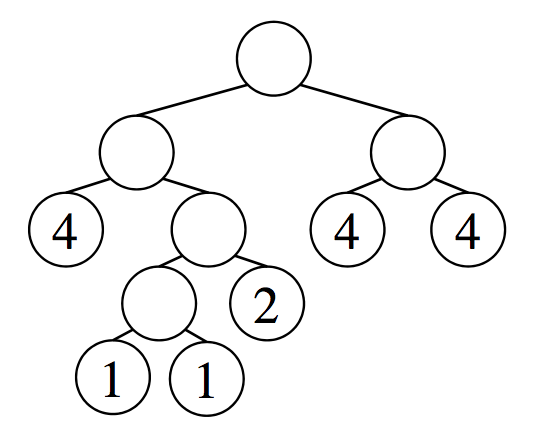

## 문제

Consider a binary tree whose leaves are assigned integer weights. Such a tree is called balanced if, for every non-leaf node, the sum of the weights in its left subtree is equal to that in the right subtree. For instance, the tree in the following figure is balanced.



Figure I.1. A balanced tree

A balanced tree is said to be hidden in a sequence A, if the integers obtained by listing the weights of all leaves of the tree from left to right form a subsequence of A. Here, a subsequence is a sequence that can be derived by deleting zero or more elements from the original sequence without changing the order of the remaining elements.

For instance, the balanced tree in the figure above is hidden in the sequence 3 4 1 3 1 2 4 4 6, because 4 1 1 2 4 4 is a subsequence of it.

Now, your task is to find, in a given sequence of integers, the balanced tree with the largest number of leaves hidden in it. In fact, the tree shown in Figure I.1 has the largest number of leaves among the balanced trees hidden in the sequence mentioned above.

## 입력

The input consists of multiple datasets. Each dataset represents a sequence A of integers in the format

```

N
A1 A2 . . . AN
```

where 1 ≤ N ≤ 1000 and 1 ≤ Ai ≤ 500 for 1 ≤ i ≤ N. N is the length of the input sequence, and Ai is the i-th element of the sequence.

The input ends with a line consisting of a single zero. The number of datasets does not exceed 50.

## 출력

For each dataset, find the balanced tree with the largest number of leaves among those hidden in A, and output, in a line, the number of its leaves.
