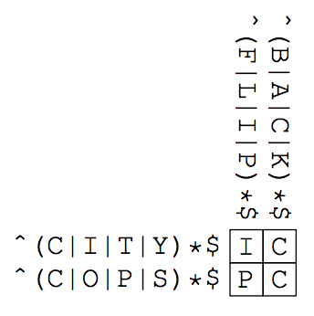

## 문제

The first crossword puzzle was published on December 21, 1913 by Arthur Wynne. To celebrate the centennial of his great-great-grandfather’s invention, John “Coward” Wynne1 was struggling to make crossword puzzles. He was such a coward that whenever he thought of a tricky clue for a word, he couldn’t stop worrying if people would blame him for choosing a bad clue that could never mean that word. At the end of the day, he cowardly chose boring clues, which made his puzzles less interesting.

One day, he came up with a brilliant idea: puzzles in which word meanings do not matter, and yet interesting. He told his idea to his colleagues, who admitted that the idea was intriguing. They even named his puzzles “Coward’s Crossword Puzzles” after his nickname.

However, making a Coward’s crossword puzzle was not easy. Even though he did not have to think about word meanings, it was not easy to check if a puzzle has one and only one set of answers. As the day of the centennial anniversary was approaching, John started worrying if he would not be able to make interesting ones in time. Let’s help John by writing a program that solves Coward’s crossword puzzles.

Each puzzle consists of h × w cells along with h across clues and w down clues. The clues are regular expressions written in a pattern language whose BNF syntax is given as in the table below.

```

clue       ::= "^" pattern "$"
pattern    ::= simple | pattern "|" simple
simple     ::= basic | simple basic
basic      ::= elementary | elementary "*"
elementary ::= "." | "A" | "B" | ... | "Z" | "(" pattern ")"
```

Table J.1. BNF syntax of the pattern language.

The clues (as denoted by p and q below) match words (as denoted by s below) according to the following rules.

* ^p\$ matches s if p matches s.
* p|q matches a string s if p and/or q matches s.
* pq matches a string s if there exist s1 and s2 such that s1s2 = s, p matches s1, and q matches s2.
* p\* matches a string s if s is empty, or there exist s1 and s2 such that s1s2 = s, p matches s1, and p\* matches s2.
* Each of A, B, . . . , Z matches the respective letter itself.
* (p) matches s if p matches s.
* . is the shorthand of (A|B|C|D|E|F|G|H|I|J|K|L|M|N|O|P|Q|R|S|T|U|V|W|X|Y|Z).

Below is an example of a Coward’s crossword puzzle with the answers filled in the cells.



Java Specific: Submitted Java programs may not use classes in the java.util.regex package.

C++ Specific: Submitted C++ programs may not use the std::regex class.

1All characters appearing in this problem, except for Arthur Wynne, are fictitious. Any resemblance to real persons, living or dead, is purely coincidental.

## 입력

The input consists of multiple datasets, each of which represents a puzzle given in the following format.

```

h w
p1
p2
.
.
.
ph
q1
q2
.
.
.
qw
```

Here, h and w represent the vertical and horizontal numbers of cells, respectively, where 2 ≤ h, w ≤ 4. The pi and qj are the across and down clues for the i-th row and j-th column, respectively. Any clue has no more than 512 characters.

The last dataset is followed by a line of two zeros. You may assume that there are no more than 30 datasets in the input.

## 출력

For each dataset, when the puzzle has a unique set of answers, output it as h lines of w characters. When the puzzle has no set of answers, or more than one set of answers, output “none” or “ambiguous” without double quotations, respectively.
