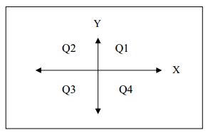

## 문제

2차원 좌표 상의 여러 점의 좌표 (x,y)가 주어졌을 때, 각 사분면과 축에 점이 몇 개 있는지 구하는 프로그램을 작성하시오.

## 입력

첫째 줄에 점의 개수 n (1 ≤ n ≤ 1000)이 주어진다. 다음 n개 줄에는 점의 좌표 (xi, yi)가 주어진다. (-106 ≤ xi, yi ≤ 106)

## 출력

각 사분면과 축에 점이 몇 개 있는지를 예제 출력과 같은 형식으로 출력한다.
