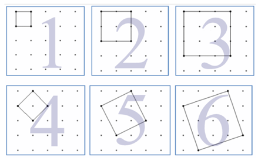

## 문제

격자 정사각형은 모든 꼭짓점이 격자점 위에 있는 정사각형이다. 격자점은 x좌표와 y좌표가 모두 정수인 점이다. 예를 들어, (1,5)는 격자점이지만, (1, 1.5)는 아니다.

m×n 격자 위에 격자 정사각형은 총 몇 개가 있을까?

위의 그림은 4×4 격자 위에서 찾을 수 있는 격자 정사각형의 일부이다. 그림 1, 2, 3과 같이 축에 평행한 격자 정사각형도 있고, 4, 5, 6과 같이 평행하지 않은 정사각형도 있다. 그림 2, 4, 6의 정사각형은 넓이가 짝수이고, 1, 3, 5는 홀수이다.

격자의 크기가 주어졌을 때, 넓이가 홀수인 격자 정사각형은 총 몇 개가 있는지 구하는 프로그램을 작성하시오.

두 격자 정사각형이 네 변을 모두 공유하지 않으면 다른 정사각형이다.

## 입력

입력은 최대 50000줄로 이루어져 있다. 각 줄에는 m과 n이 주어진다. (1 ≤ m, n ≤ 100000) 입력의 마지막 줄에는 0이 두 개 주어진다.

## 출력

각 입력마다 넓이가 홀수인 격자 정사각형의 수를 출력한다. 정답은 항상 64비트 정수(64-bit signed integer) 범위이다.
