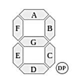
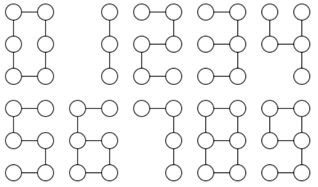
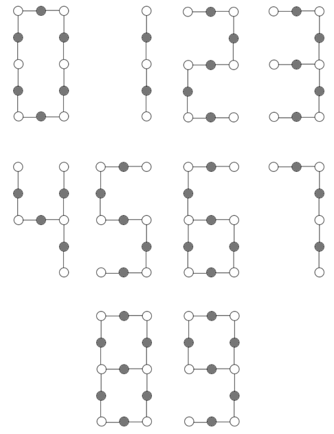

## 문제

세븐 세그먼트 디스플레이는 다양한 곳에서 사용된다. 이 디스플레이는 세븐 세그먼트를 이용해서 숫자를 화면에 표시한다.

아래 그림은 전형적인 세븐 세그먼트 디스플레이가 사용하는 모든 세그먼트를 묘사한 그림이다. (앞으로 세븐 세그먼트 디스플레이를 SSD로 줄여서 쓴다)

그림 1. SSD에서 사용하는 세그먼트 (DP는 소수점을 나타낸다. 이 문제에서는 사용하지 않는다)

SSD에서 0부터 9까지 숫자를 표현하는 방법은 아래와 같다.

* 0은 세그먼트 A, B, C, D, E, F를 사용한다.
* 1: B, C
* 2: A, B, G, E, D
* 3: A, B, C, D, G
* 4: B, C, F, G
* 5: A, C, D, F, G
* 6: A, C, D, E, F, G
* 7: A, B, C
* 8: A, B, C, D, E, F, G
* 9: A, B, C, D, F, G

SSD에서 숫자의 표현을 그래프로 생각할 수가 있다. 세그먼트의 양 끝점을 노드로, 세그먼트를 간선으로 표현하면 숫자는 아래와 같이 나타낼 수 있다.

위의 그래프를 차수가 0인 SSD 그래프라고 한다. 차수가 k(k > 0)인 SSD그래프는 차수가 0인 SSD 그래프의 각 간선을 k+1개의 간선으로 나누고, 그 사이에 노드 k개를 삽입해 만들 수 있다.

차수가 1인 SSD 그래프에서 모든 숫자를 나타내는 방법은 아래와 같다. 어두운 노드는 새로 생긴 노드이다.

노드 n개와 간선 m개로 이루어진 그래프가 주어진다. 입력으로 주어진 그래프가 나타낼 수 있는 숫자와 그래프의 차수를 모두 구하는 프로그램을 작성하시오.

## 입력

첫째 줄에 테스트 케이스의 개수 T (1 ≤ T ≤ 20)가 주어진다. 각 테스트 케이스의 첫째 줄에 n (1 ≤ n ≤ 500)과 m (1 ≤ m ≤ 1000)이 주어진다. 다음 m개 줄에는 간선의 정보 (u, v)가 주어진다. 노드는 1번부터 n번까지 번호가 매겨져 있으며, 중복되는 간선이나 u와 v가 같은 간선은 입력으로 주어지지 않는다.

## 출력

각 테스트 케이스마다 Case X: Y를 첫째 줄에 출력한다. X는 테스트 케이스의 번호이고, Y는 가능한 (숫자, 차수) 쌍의 개수이다. 그 다음 줄부터 한 줄에 하나씩 가능한 숫자와 차수를 공백으로 구분해 출력한다. 숫자가 작은 순서대로, 같은 경우에는 차수가 작은 순서대로 출력한다. 테스트 케이스 사이에는 빈 줄을 하나 출력한다.
