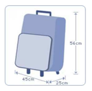

## 문제

Cabin baggage (also called carry on or hand baggage) is a bag that a passenger is allowed to bring into an aircraft. For safety purpose, cabin baggage must not be too heavy or too big. Every airline company can set its own size and weight limits of cabin baggage according to the IATA (International Air Transport Association) guidelines.

ICPC airline has set the cabin baggage limits as follows:

Cabin baggage should have a maximum length of 56 cm, width of 45 cm and depth of 25 cm or the sum of all 3 sides (length+width+depth) should not exceed 125 cm. Its weight must not exceed 7 kg.

The company has a laser measurement device with high precision to evaluate the size and weight of cabin baggage. The device gives 4 values which are positive numbers with 2 decimal points. They are length, width, depth (in cm) and weight (in kg), respectively.

For example,

* 51.23 40.12 21.20 3.45 (this bag is allowed)
* 60.00 30.00 20.00 7.00 (this bag is allowed)
* 52.03 41.25 23.50 7.01 (this bag is not allowed)

You task is to write a program to check whether or not a cabin baggage is allowed.

## 입력

The first line contains an integer t (1≤ t ≤ 300) which determines the number of test cases (i.e. cabin baggage to verify). The following t lines contain the measurement of cabin baggage. Each line contains 4 values which are length, width, depth and weight, respectively. All these 4 values are positive numbers with 2 decimal points.

## 출력

For each test case, print out in a line, 1 if it is allowed or 0 otherwise. Finally, print out the total number of the allowed bags in the last line.
