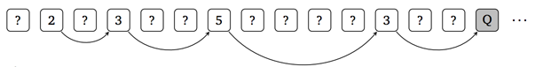

## 문제

I am learning magic tricks to impress my girlfriend Alice. My latest trick is a probabilistic one, i.e. it does work in most cases, but not in every case. To perform the trick, I first shuffle a set of many playing cards and put them all in one line with faces up on the table. Then Alice secretly selects one of the first ten cards (i.e. she chooses x0, a secret number between 1 and 10 inclusive) and skips cards repeatedly as follows: after having selected a card at position xi with a number c(xi) on its face, she will select the card at position xi+1 = xi + c(xi). Jack (J), Queen (Q), and King (K) count as 10, Ace (A) counts as 11. You may assume that there are at least ten cards on the table.

Alice stops this procedure as soon as there is no card at position xi + c(xi). I then perform the same procedure from a randomly selected starting position that may be different from the position selected by Alice. It turns out that often, I end up at the same position. Alice is very impressed by this trick.

However, I am more interested in the underlying math. Given my randomly selected starting position and the card faces of every selected card (including my final one), can you compute the probability that Alice chose a starting position ending up on the same final card? You may assume that her starting position is randomly chosen with uniform probability (between 1 and 10 inclusive). I forgot to note the cards that I skipped, so these cards are unknown. You may assume that the card face of every single of the unknown cards is independent of the other card faces and random with uniform probability out of the possible card faces (i.e. 2-10, J, Q, K, and A).

Figure 1 – Illustration of first sample input: my starting position is 2, so I start selecting that card. Then I keep skipping cards depending on the card’s face. This process iterates until there are not enough cards to skip (in this sample: Q). The final Q card is followed by 0 to 9 unknown cards, since Q counts as 10.

## 입력

For each test case:

* A line containing two integers n (1 ≤ n ≤ 100) and m (1 ≤ m ≤ 10) where n is the number of selected cards and m is the 1-based position of my first selected card.
* A line with n tokens that specify the n selected card faces (in order, including the final card). Each card face is given either as an integer x (2 ≤ x ≤ 10) or as a single character (J, Q, K, or A as specified above).

## 출력

For each test case, print one line containing the probability that Alice chooses a starting position that leads to the same final card. Your output should have an absolute error of at most 10-7.
