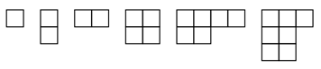
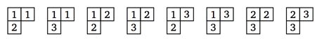

## 문제

영 다이어그램이란 박스를 다음과 같은 조건에 따라서 배열한 것이다.

* 박스는 각각의 행과 열에 대해서 연속적이어야 한다.
* 모든 행은 모두 가장 왼쪽을 기준으로 정렬되어 있어야 한다.
* 각각의 행은 바로 위에 있는 행보다 길 수 없다.

다음은 영 다이어그램의 예시이다.

영 태블로는 영 다이어그램에 아래와 같은 조건을 지키면서 수를 채운 것이다.

* 각각의 박스에는 1과 N을 포함하는 그 사이의 정수가 채워져 있다.
* 각 박스에 적혀있는 정수는 왼쪽에 있는 정수보다 크거나 같아야 한다.
* 각 박스에 적혀있는 정수는 위에 있는 정수보다 커야 한다.

N = 3인 경우 아래 그림은 가능한 영 태블로의 예시이다.

N과 영 다이어그램의 형태가 주어졌을 때, 영 태블로를 만드는 방법의 수를 구하는 프로그램을 작성하시오.

## 입력

각각의 테스트 케이스는 두 줄로 이루어져 있다. 각 테스트 케이스의 첫째 줄은 영 다이어그램을 나타낸다. 첫 번째로 주어지는 수 k는 1 ≤ k ≤ 7을 나타내며, 행의 개수를 나타낸다. 다음 k개의 정수는 각 행에 있는 박스의 개수 l1, l2, ... , lk이며, 7 ≥ l1 ≥ l2 ≥ ··· ≥ lk ≥ 1을 만족한다. 둘째 줄에는 N이 주어지고, k ≤ N ≤ 7을 만족한다.

## 출력

각각의 테스트 케이스마다 만들 수 있는 영 태블로의 개수를 출력한다.
