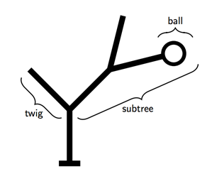
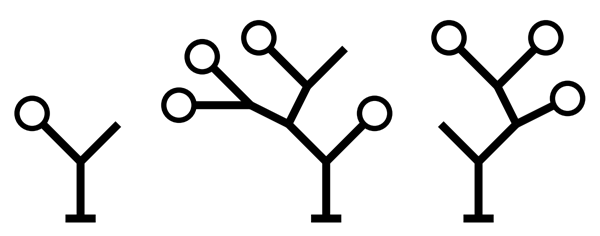

## 문제

It will soon be time to decorate the Christmas tree. The NWERC judges are already debating the optimal way to put decorations in a tree. They agree that it is essential to distribute the decorations evenly over the branches of the tree.

This problem is limited to binary Christmas trees. Such trees consist of a trunk, which splits into two subtrees. Each subtree may itself split further into two smaller subtrees and so on. A subtree that does not split any further is a twig. A twig may be decorated by attaching at most one ball to it.

Figure 1 – Example of a tree with subtrees, twigs and one ball.

A decorated tree has an even distribution of balls if and only if the following requirement is satisfied:

At every point where a (sub)tree splits into two smaller subtrees t1 and t2, the total number of balls in the left subtree N(t1) and the total number of balls in the right subtree N(t2) must either be equal or differ by one. That is: | N(t1) − N(t2) | ≤ 1.

In their enthusiasm, the judges initially attach balls to arbitrary twigs in the tree. When they can not find any more balls to put in the tree, they stand back and consider the result. In most cases, the distribution of the balls is not quite even. They decide to fix this by moving some of the balls to different twigs.

Given the structure of the tree and the initial locations of the balls, calculate the minimum number of balls that must be moved to achieve an even distribution as defined above.

Note that it is not allowed to add new balls to the tree or to permanently remove balls from the tree. The only way in which the tree may be changed is by moving balls to different twigs.

## 입력

For each test case, the input consists of one line describing a decorated tree.

The description of a tree consists of a recursive description of its subtrees. A (sub)tree is represented by a string in one of the following forms:

* The string ‘()’ represents a twig without a ball.
* The string ‘(B)’ represents a twig with a ball attached to it.
* The string ‘(t1 t2)’ represents a (sub)tree that splits into the two smaller subtrees represented by t1 and t2, where t1 and t2 are strings in one of the forms listed here.

A tree contains at least 2 and at most 1000 twigs.

## 출력

For each test case, print one line of output.

If it is possible to distribute the balls evenly through the tree, print the minimum number of balls that must be moved to satisfy the requirement of even distribution.

If it is not possible to distribute the balls evenly, print the word ‘impossible’.

## 힌트

Figure 2 – Trees corresponding to the example input cases.
