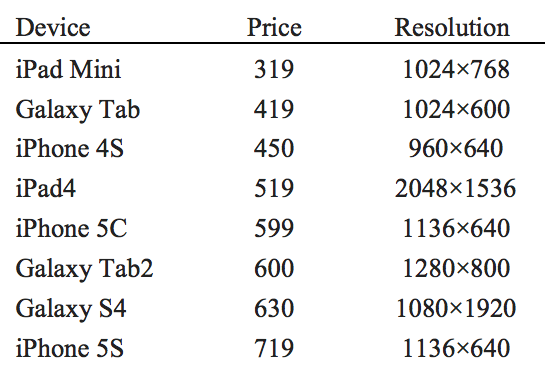

## 문제

The “Last ACM Contest” movie has been recently released and got the record of the highest worldwide gross. Gabby has been so busy due to his practicing for the ACM programming contest in Tehran site and hence, he has not succeeded to watch the movie at a cinema. Like many other people, he has legally downloaded the movie to watch it using a smart phone or a tablet on the way back home from the Sharif University on 20 December 2013, the contest day. Unfortunately, he has neither a smart phone nor a tablet. He therefore has decided to buy a device from the following smart phones or tablets that are available in the market.

  
As you can see, each device has a known “height × width” resolution which is the number of distinct pixels in each dimension that can be displayed. Like the above devices, each movie has a known resolution HxW and video players equally scale both dimensions of the movie resolution by a factor of c to display it in a [cH]x[cW] window where [x] is the largest integer not greater than x and c is a rational number such that cH and cW are not greater than the height and width resolutions of the display, respectively. Indeed, video players zoom a movie in or out while preserving the aspect ratio (the ratio of the height resolution to the width resolution) of the movie. When a video player displays a movie in the full-screen window in a device, some parts of the device display may remain “blank” (or unused) due to the difference in the aspect ratios of the device display and the movie. For a movie resolution and a display resolution, the usage ratio is defined to be the ratio of the non-blank area of the full-screen video-player window showing the movie to the area of the device display. As all above devices can rotate the whole screen 90 degrees, they may increase their usage ratio for a movie. For instance, if the movie resolution is 720x480, the usage ratio of iPad4 is the maximum of (2048\*1365)/(2048\*1536) and (1536\*2048) (the latter is due to a 90-degree rotation) which is 1365/1536.

Gabby is now looking for a device with the highest usage ratio for the “Last ACM Contest” movie which is stored with the resolution HxW. He kindly asks you to report him this device before the end of the contest.

## 입력

There are multiple test cases in the input. Each test case consists of a line containing two integers 1 ≤ H,W ≤ 5000 which is the resolution of the “Last ACM Contest” movie. The input terminates with “0 0” which should not be processed.

## 출력

For each test case, output a line containing the price of the device which has the highest usage ratio for the given movie resolution. In case of a tie, output the smallest price. For example, if both iPad4 and iPad Mini have the highest usage ratio, output 319.
