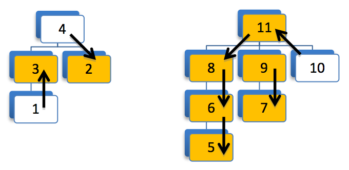

## 문제

According to an intelligence source, we’ve got a traitor in ACM Security Agency (ASA). ASA has a hierarchical structure where each agent has a manager and there are also some (at least one) top managers who are not managed by anyone. Our source doesn’t exactly know the traitor, but he has a list of suspects. Therefore, all we know is that there is exactly one traitor in our agency and we have a list of suspects. In order to find that traitor, we want to assign a watcher for each suspect, satisfying the following three conditions:

1. Two suspects cannot watch each other.
2. Each suspect should be watched by either his manager or one of his direct employees.
3. Nobody can watch more than one suspect.

If we want to satisfy all above conditions, it may be impossible to watch all suspects. Therefore, you should write a program that gets the structure of ASA and the list of suspects as the input and finds the maximum number of suspects for whom the watcher assignment is possible. In the following figure that illustrates the organizational structure of ASA with two top managers and eleven agents, the suspects are indicated with gray color. One watcher assignment covering 7 out of 8 suspects is possible in this case which is shown by arrows. An arrow from agent x to agent y, means agent x is supposed to watch agent y. It can be shown that in this example there is no watcher assignment covering all suspects.

## 입력

There are multiple test cases in the input. The first line of each test case contains two integers n(1 ≤ n ≤ 10,000) specifying the number of agents, and k(1 ≤ k ≤ n) specifying the number of the suspected agents. The agents are numbered from 1 to n. On the second line there are n space-separated integers, where the ith number is the number of agent who is the manger of the agent i. A zero means the agent i is a top manager. On the third line there are k positive integers s1, s2, …, sk, indicating the numbers of the suspected agents. The input terminates with “0 0” which should not be processed.

## 출력

For each test case, output in a line the maximum number of suspects for whom the watcher assignment is possible.
