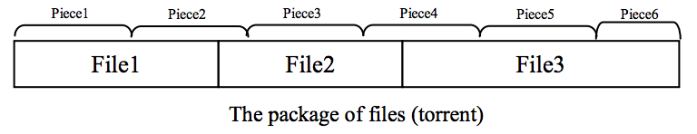

## 문제

The BitTorrent is a protocol for transferring large files running over a peer-to-peer network in which nodes act as both clients and servers, in contrast to the centralized client–server architecture where client nodes request central servers to get resources. Indeed, the protocol allows users to establish a group of hosts to download and upload files from each other simultaneously. Precisely, the whole package of files (so-called torrent) is segmented into pieces as depicted in the figure. For instance, a 10 MB package might be segmented into exactly ten 1M-size pieces or exactly forty 256KB-size pieces. As each host (or peer) receives a new piece of the torrent it becomes a source of that piece for other hosts willing to have that piece. Pieces are typically downloaded nonsequentially and are rearranged into the correct order by hosts. Each host independently manages which pieces must be downloaded. Pieces are of the same size throughout a single torrent download except the last piece which may have a smaller size.

You want to download a package of files, but you are approaching your monthly Internet usage limit and you don’t want to wait till the next month. You want to download the maximum number of files with the bandwidth left. Which pieces must be downloaded?

## 입력

The input contains multiple test cases. Each test case starts with three space-separated integers N, P, and L where N is the number of files in the torrent (1 ≤ N ≤ 3000), P is the size of pieces in KB (1 ≤ P ≤ 1000), and L is the remaining kilobytes from your monthly Internet usage limit (1 ≤ L ≤ 106). The second line of a test case contains N space-separated positive integers not exceeding 100,000 where the ith integer is the size (in KB) of the ith file in the torrent. The input terminates with “0 0 0” which should not be processed.

## 출력

For each test case, output a line containing the maximum number of files which can be downloaded from the torrent.
