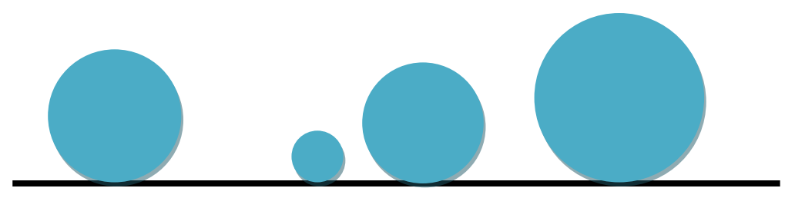

## 문제

The 2D-solar system like our solar system comprises Bigsun (its sun) and its planetary system of many circular planets orbiting around Bigsun. Due to the high gravity of Bigsun, all planets have been attracted by Bigsun. Precisely, they orbit around Bigsun while being tangent to it as depicted in the figure (As Bigsun is so huge, its boundary looks like a line.) Surprisingly, up to the current time no two planets have collided with each other, but no one knows whether the system is free of collisions in the future. You are to write a program to verify whether there is a possibility of any collision in the future and if so, compute the time at which the first collision happens. The scientists of NASA have  
realized that each planet in the 2D-solar system moves with a constant velocity. More precisely, it turned out that the motion equation of a planet can be described by the position of its touching point with the boundary of Bigsun through time by the linear equation y=at + b where a and b are two known parameters and t denotes time.

## 입력

There are multiple test cases in the input. Each test case starts with a line containing an integer n (0 ≤ n ≤ 50000) where n is the number of planets. The ith line of the next n lines contains 3 space-separated integers ri, ai, and bi whose absolute values are not exceeding 1,000,000,000. The number ri which is a positive square number, denotes the radius of Planet i and ai and bi specify its motion equation, i.e. the position of the tangent point of the planet on the boundary of Bigsun at time t is ait+bi. The input terminates with a line containing “0” which should not be processed.

## 출력

For each test case, output a line containing the time at which the first collision happens under the assumption that the current time is equal to 0 and all planets are disjoint at the current time. If the system is free of collisions you must output “Collision-Free System”. The output must be rounded to exactly two digits after the decimal point.
