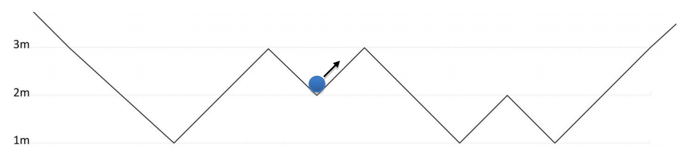

## 문제

There are a lot of mountain ranges in the Neverlands. Every mountain range consists of a number of valleys and summits. The slope between two consecutive summit and valley is always either 1 or -1, and all the summits and the valleys have integer heights. A bowling ball is swinging on a part of a mountain range consisting of n valleys and n-1 summits. The ball is always touching down the surface of the mountain range (it does not jump). Mountains before the first and after the last valleys are too high such that the ball can never exit the mountain range. At time t0 the ball is located in the valley number s moving to the upper-right direction and it has an initial kinetic energy K0. The following figure shows a mountain range with 4 valleys and 3 summits, and the ball located in the 2nd valley (enumerated from left to right).

By the simple physics we know that at any time t the ball has a gravitational potential energy Pt=mgh and also a kinetic energy Kt=(1/2)mv2, where m is the mass of the ball, g is the constant of the Earth gravity (here equals to 10), and h and v are the height and the velocity of the ball at time t. By the transformation of energy from potential to kinetic or vice versa, the total energy of the ball Pt+Kt is fixed during its movements, unless it falls into a valley: at the ith valley (from left), ci units of the kinetic energy is lost due to friction or it stops if its kinetic energy is below ci but consider no friction in other locations. Note that the ball loses cs unit of energy when it leaves the starting valley at time t0. You can assume the ball diameter is equal to 0 and its mass is equal to 1. Your task is to find the valley or summit at which the ball will stop.

## 입력

There are multiple test cases in the input. The first line of each test case contains three space-separated positive integers n, and s and K0(1 ≤ n ≤ 3000, 1 ≤ s ≤ n, 1 ≤ K0 ≤ 1015). Each of the following n lines contains two integers hi and ci, the height and friction of the ith valley. The jth line of the next n-1 lines contains Hj, the height of The jth summit from the left (0 ≤ hi,ci,Hj ≤ 109). It is guaranteed that at least one of cis is greater than zero. The input terminates with “0 0 0 0” which should not be processed.

## 출력

For each test case, output a line conforming one of the following formats depending on whether the ball stops at either a valley or a summit.

* If the ball stops at valley number k, output “Valley: k” (omit the quotes.)
* If the ball stops at Summit number k, output “Summit: k (omit the quotes.)
