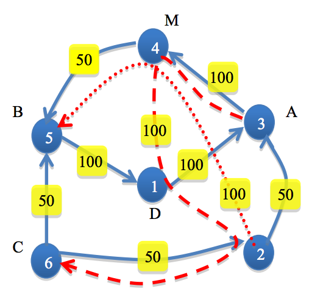

## 문제

Ad Hoc Postal Company (AHPC) has a simple strategy to deliver postal envelopes: It advertises for a volunteer and buys for him/her the cheapest flight-plan from the source to the destination city, and gives the volunteer a bag of envelopes in the source airport to be handed over the company’s correspondent in the destination airport.

In addition to direct flights between two airports, there are indirect trips with stops in several different intermediate airports. An indirect trip passenger must always start from the first airport and visit the intermediate airports consecutively (according to the indirect trip schedule, without using any other direct flights or indirect trips in the middle) but may leave the rest of the indirect trip at any intermediate airport. The price of an indirect trip is fixed; no matter if the passenger uses all the flights or interrupts in the middle. A flight-plan can consist of several direct flights and whole or partial of indirect trips.

In sake of economy, AHPC is looking to use mixed flight plans: suppose a couple of bags, one should be delivered from A to B and another from C to D (A, B, C, D are different airports). The company may buy two flight plans from A to D for the first volunteer, and from C to B for the second one, such that the two plans share the same airport M (not necessarily different from these 4 airports) at which the two volunteers meet and exchange their bags. Hence, AHPC ensures each bag is delivered to the right destination, while the total price might be reduced.

  
As an example, six airports together with direct flights (solid arrows), indirect trips (dash and dot arrows) and their prices are illustrated in the above figure. Two bags should be sent, one from the airport 3(A) to 5(B), another from 6(C) to 1(D). The company might purchase (3,4), (4,5) as the flight-plan of the first volunteer, and (6,5), (5,1) for the second with the total cost of 300. But the cheaper alternative would be (3,4,1,2,6) for the first and (6,2), (2,4,5) for the second volunteer, with the total cost of 250. The volunteers meet and exchange bags at airport 4(M) and the first volunteer will leave the indirect trip at airport 1.

You should write a program that given flights information, finds the most economic cost for delivery of the bags.

## 입력

There are multiple cases in the input. The first line of each case contains six integers n, m, A, B, C, and D, where n (4 ≤ n ≤ 100) is the number of airports, and m(0 ≤ m ≤ 10,000) is the total number of direct flights and indirect trips, where at most of them are indirect trips. The ith line of the next m lines starts with two positive integers pi(the price, pi ≤ 106) and si (being 1 for direct flight and more for indirect trip), followed by si+1 distinct airport numbers that show the order of airports visited in the ith direct flight/indirect trip. The input terminates with “0 0 0 0 0 0” which should not be processed.

## 출력

For each test case, output the total cost of the cheapest flight plan in a line, or output “Impossible!” (without quotes) if delivery of at least one bag is impossible.
