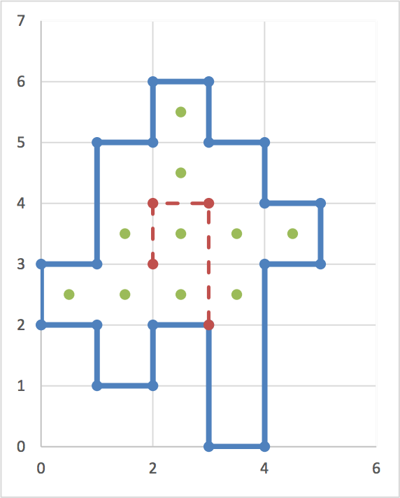

## 문제

A robot equipped with a camera is to sweep some areas in a museum. The museum is a polygon with only horizontal and vertical walls as depicted in the figure. We assume that the polygon is drawn on an underlying mesh of 1x1 cells and its vertices are on the mesh vertices. The robot is also restricted to move only along the mesh edges either horizontally or vertically. Its camera sweeps everything that can be seen on the perpendicular directions of its moving path. That is, when the robot moves horizontally, its camera is directed vertically and can only see any visible items located on the north and south of the horizontal segment of the moving path. Similarly, its camera can see any visible cells located on the east and west of the vertical segment of the moving path. In the figure, a polygon and a moving path of our robot (the dashed line path) are shown. Here, the dotted squares are seen.

Given such a polygon and a robot-path inside it, the problem is to compute the total areas (total number of squares) seen by the robot.

## 입력

There are multiple test cases in the input. Each test case starts with a line containing two integers n and k (2 ≤ n,k ≤ 100) where n is the number of walls (or vertices) of the museum and k is the number of the vertices of the robot path. The next n lines describe the museum vertices. The ith line contains 2 space-separated non-negative integers xi and yi not exceeding 500 denoting the x and y coordinates of the ith vertex of the museum, respectively. There is a wall between vertices i and i+1 (You may assume the (n+1)th vertex is the first vertex). The next k lines describe the vertices of the robot path in order of appearing on the path from the starting point to the ending point; each line contains two integers which are the x and y coordinates of a vertex. The robot path is guaranteed to be inside the museum but its vertices (not its edges) can touch the museum walls. Note that the robot path may intersect itself. The input terminates with a line containing “0 0” which should not be processed.

## 출력

For each test case, output the total area (total number of squares) seen by the given robot.
