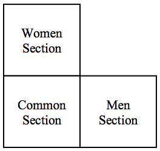

## 문제

Kamran has recently bought a rectangular flat garden in an awesome part of the countryside. His business plan is to construct a Hall to host wedding ceremonies, since the countryside has recently attracted a lot of attention for being a fantastic area to host wedding ceremonies. As women and men sections must be separated based on the nation law, he thinks of designing the hall in three sections: men section, women section and common section (including rest rooms, dinner room and etc). As the common section must be easily  accessible to all persons, it must be designated in the middle of the other two sections. Among several proposal designs, Kamran has selected the one depicted below where all three sections are squares of the same size, they are attached to each other like an L shape, their sides are parallel to the garden sides, and the visible sides of the common section from outside face the south and west of the garden. Now the main question is where the hall must be constructed. The garden is full of old trees and cutting the trees is forbidden due to high air pollution. He kindly asks you to help him to find the largest hall that he can construct.

## 입력

There are multiple test cases in the input. Each test case starts with a line containing a non-negative integers n(1 ≤ n ≤ 50000) and two positive integers a and b (all not exceeding 1,000,000) where n is the number of distinct trees in the garden and a and b specify the sides of the garden. Precisely, [0,a]x[0,b] denotes the rectangle modeling the garden. The next n lines, each contains 2 space-separated non-negative integers xi and yi (0 < xi < a, 0 < yi < b) denoting the x and y coordinates of a tree, respectively. You may assume that trees have distinct coordinates and the south side (i.e. [0,a]) and the west side (i.e. [0,b]) of the garden lie on the x-axis and the y-axis, respectively. The input terminates with a line containing “0 0 0” which should not be processed.

## 출력

For each test case, output the area of the largest hall that Kamran can construct in his garden. Note that the hall can touch the trees or the garden sides but it can’t interiorly include them. The output must be rounded to “exactly” two digits after the decimal point.
