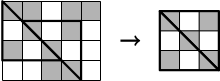

## 문제

Byteasar would fancy a game of checkers, however his chessboard got lost somewhere. He only managed to find a wooden board, sized n × m, divided into nm equal in size, square fields. Each field is painted either white or black, however the arrangement of the colours on this board not necessarily matches the proper chessboard pattern. In such a case Byteasar has decided to utilise his carpentry experience and with the help of a saw he plans to cut out a chessboard, which is a square consisting of certain number of fields, where two fields sharing sides have alternate colours.

It is not clear whether Byteasar manages to find out a properly sized square on the board. So, he decided to cut out two triangular pieces from the board in order to glue them together in such a way that a chessboard would be created. (The pieces must be separable, however they may be turned around in any way after cutting out). Help Byteasar and calculate the largest chessboard size that he is able to obtain by using this method. The figure below presents the board sized 4 × 5 and the two triangles, which could be glued together in order to form chessboard sized 3 × 3:

## 입력

The first input line contains two integers n and m (1 ≤ n, m ≤ 1,000): the board size. The following n lines contains m integers each: j-th number from i-th line (1 ≤ i ≤ n, 1 ≤ j ≤ m) describes the colour positioned on the intersection of j-th column and i-th row of the board. Digit 0 describes white field and digit 1 - black field.

## 출력

The first and only output line should contain one integer, representing the largest chessboard size, which is obtainable by cutting two triangular pieces from the board and pasting them together.
