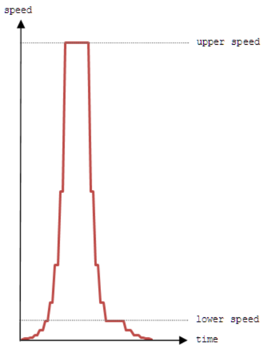

## 문제

In the year 2037, i.e., two and a quarter centuries after the first commercial rail road locomotive was built, the world triumphed with the successful roll-out of supersonic magnetic levitation capsules called supercaps. These supercaps are the new generation of Transrapid vehicles, which can readily attain and travel at top speed of 512 ms-1. As a result, travellers can make trips between cities in matter of seconds if not minutes.

The power of the supercap lies in its ability to accelerate and decelerate instantly. The acceleration is strictly in integral powers of two starting with the zeroth power such that each subsequent speed is double the one before. Each speed during acceleration is maintained for a single second only. For example the speed during the first, second, third and fourth seconds are 20ms-1, 21ms-1, 22ms-1, 23 ms-1. The acceleration continues in this manner until a computed upper speed (≤ 512 ms-1) is reached. For sake of simplicity, you can assume that the supercap’sacceleration is instantaneous and discrete.

The supercap decelerates from its upper speed to a predetermined lower speed (= 16 ms-1) also strictly in integral powers of two, such that each subsequent speed is half the one before. Similar to acceleration, each speed during deceleration to the lower speed is maintained for a single second only. You can also assume that the deceleration is instantaneous and discrete.

However, the supercap has been designed to glide, i.e., maintain a speed for duration longer than one second, at the upper speed, as well as, at the lower speed and the speeds below it. In this way, the supercap can slow down gradually to halt, if necessary.

In summing, the motion of the supercap can be divided into four parts. In the first part, the supercap will accelerate multiplicatively to a computed upper speed. In the second part, the supercap glides at the upper speed. In the third part, the supercap decelerates multiplicatively to a predetermined lower speed. In the final part, the supercap slows down to halt by gliding at the lower speed and/ or the speeds below it. The speed-time graph below illustrates the typical motion of a supercap.

During the first phase of development, the supercap transrapid rail road links will be developed to connect the capital city of each region to only one city in each of its neighbouring regions. Cities within a region will not be connected by the supercap transrapid system.

The cost of developing the supercap transrapid system will be borne by the travellers. The fare is relative to the speed of the supercap. It will be based on the travelling time above, at, and below the lower speed. The supercap transrapid system corporation has come up with a simple formula to calculate the fare F, which is proportional to result of the equation below. It is profitable to the corporation if a supercap’s time of travel above the lower speed A is as long as possible and its time of travel at or below the lower speed B is as short as possible. The penalty for B is 100 times that of A.

F ∞ (A - 100 B)  
where A = Travelling time > lower speed  
and B = Travelling time ≤ lower speed

You are required to determine the most profitable supercap rail road links that a region must develop first, i.e., the regional links from which the supercap transrapid system corporation can derive maximum fare revenue.

## 입력

The first line of input contains an integer T (1 ≤ T ≤ 10), the number of test cases. On the first line of each test case, there will be an integer R (1 ≤ R ≤ 10), the number of neighbouring regions, followed by information about the cities with Transrapid stations in each of the R neighbouring regions.

Each neighbouring region information starts with an integer C (1 ≤ C ≤ 10), the number of cities in that region followed by C lines of city-distance description. Each city-distance description consists of a city name Y and an integer D (1,000 ≤ D ≤ 2,000,000), the distance between the Transrapid station in capital city Z to the Transrapid station in city Y. The city name is a single word and the distance is specified in meters. You can assume that the distances between the Transrapid stations are unique.

## 출력

The output comprise of one line for each test case set. The line begins with the prefix “Case #x:” where x represents the case number (starting from one and incrementing at each new test case), followed by a single space, and then the names of the cities to which the rail road links must be developed to satisfy the conditions of the project. The order of the names in the output will follow the order of the neighbouring regions in the test case, and will be separated by a single space.
