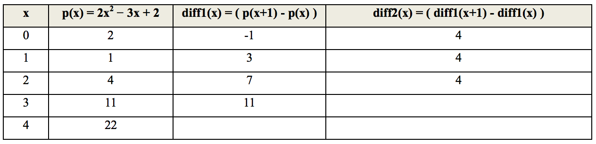

## 문제

A difference engine is an automatic mechanical calculator designed to tabulate polynomial functions. The name derives from the method of divided differences, a way to interpolate or tabulate functions by using a small set of polynomial coefficients. Both logarithmic and trigonometric functions, functions commonly used by both navigators and scientists, can be approximated by polynomials, so a difference engine can compute many useful sets of numbers.

The historical difficulty in producing error free tables by teams of mathematicians and human "computers" spurred Charles Babbage's desire to build a mechanism to automate the process.

The principle of a difference engine is Newton's method of divided differences. If the initial value of a polynomial (and of its finite differences) is calculated by some means for some value of X, the difference engine can calculate any number of nearby values, using the method generally known as the method of finite differences. For example, consider the quadratic polynomial with the goal of tabulating the values p(0), p(1), p(2), p(3), p(4), and so forth. The table below is constructed as follows: the second column contains the values of the polynomial, the third column contains the differences of the two left neighbors in the second column, and the fourth column contains the differences of the two neighbors in the third column:

The numbers in the third values-column are constant. In fact, by starting with any polynomial of degree n, the column number n + 1 will always be constant. This is the crucial fact behind the success of the method.

The initial values of columns can be calculated by first manually calculating N consecutive values of the function and by backtracking, i.e. calculating the required differences.

Your task is to develop a program that imitate Babbage’s Difference Engine by calculating a polynomial that iterate up to 50, that is p(50), based on the first n iteration.

## 입력

The first line of the input is a single positive integer T indicating the number of test cases.

For each test case, the input format is as follows:

n p(0) p(1) p(2) ... p(n)

where n is the size of polynomial and n < 6.

## 출력

For each test case, the output contains a line in the format Case #x: M, where x is the case number (starting from 1) and M is the output that required integer in a single line, based on the first iteration.
