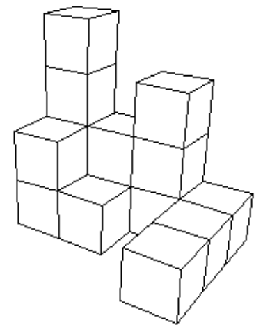

## 문제

The solid in the picture below is made up of 1x1x1 cubes in a 3D grid. In this problem, we'll limit ourselves to solids that are made up of columns rooted on the ground (a column consists of one or several 1x1x1 cubes stacked on top of each other). Such solids can be described as a matrix of digits, where each digit corresponds to the height of a column in the 2D grid that makes up the ground. A zero means there is no column at all in that position.



The corresponding matrix for the above solid will be

```

4231
2101
0001
```

The volume of such a solid is simple enough to calculate, but what we're interested here in the total surface area including the floor (that is, the number of 1x1 "squares" non hidden on the outer surface). You are given the information of the solid as a matrix. Your task is to compute the surface area of the given solid. You can assume that the solid is always connected, i.e the columns will be attached to each other in the four cardinal directions.

## 입력

First line of the input contains T, the number of test cases. Each test case starts with a line containing R and C denoting the number of rows and columns of the solid. Each of the next R lines contains C digits. Each digits are between 0 to 9 inclusive. R and C will be between 1 and 50 inclusive.

## 출력

For each test case, output the total surface area of the given solid, including the floor area.
