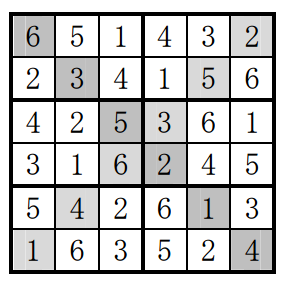

## 문제

In Mini Sudoku X, there are 6 x 6 boxes to be filled with digits so that each row, column, main diagonal, and 2 x 3 square contains all the digits from 1 to 6. An example of a solution is as follows with the main diagonals shaded:

Write a program that reads a series of 36 digits representing a solution for Mini Sudoku X, and determines whether the solution is correct.

## 입력

The first line has a positive integer T, T <= 100000, denoting the number of test cases. This is followed by each test case per line.

Each test case consists of six lines. Each line of the test case contains six 1-digit integers separated by a space.

## 출력

For each test case, the output contains a line in the format Case #x: M, where x is the case number (starting from 1) and M is either 0 or 1. 1 if the test case represents a correct solution and 0 otherwise.
