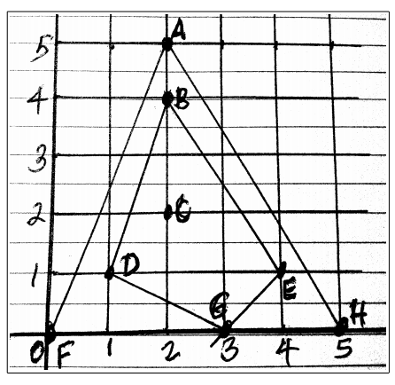

## 문제

Given a set S of N points on the plane, namely S = {(x[0], y[0]), (x[1], y[1]), ... , (x[N-1], y[N-1])}, the outer hull Ho of S is simply just the convex hull of S. It is a subset of points of S which when joined by line segments will form a convex polygon P of minimum area that includes all points of S inside P or on P. Points of S falling on P but are not corner vertices of P are not considered part of the convex hull. The inner hull Hi of S is obtained by getting the convex hull of S – Ho. That is, remove from set S all points that belong to the outer hull Ho, to get the set (S – Ho). Then compute the inner hull Hi as the convex hull of (S – Ho).

For example given the set S of 8 points A(2.0, 5.0), B(2.0, 4.0), C(2.0, 2.0), D(1.0, 1.0), E(4.0, 1.0), F(0.0, 0.0), G(3.0, 0.0), and H(5.0, 0.0), the outer hull Ho of S can be computed as the set Ho={F, H, A, F}. If we remove Ho from S, we get S – Ho = {B, C, D, E, G}. The inner hull Hi of S is computed as the convex hull of S – Ho, namely Hi = {D, G, E, B, D}. Now the area inside Ho is area(Ho) = 12.5. The area inside Hi is area(Hi) = 6.0. Thus the area between the outer hull Ho and the inner hull Hi is 12.5 – 6.0 = 6.5.

Your problem is, given a set S of N points, to write a program that computes the area between the outer hull Ho of S, and the inner hul  Hi of S.

## 입력

The input consists of several problem sets. The first line of a problem set will contain the problemID and the value of N. The value of N will not exceed 1,000. The next N lines of the problem set will contain the value of x- and y-coordinate (separated by a space) of a point, at one point per line. Each coordinate x or y will be a real number not exceeding 100.0 in absolute value. The lines of the next problem set will immediately follow the previous problem set. A line with problemID of “ZZ” and a value of N of 0 indicates the end of input.

## 출력

For each problem set, print one line of the form “ProblemID id: area” where id is the problemID given in the input, and area is the area between the outer hull Ho and the inner hull Hi that you computed. Express the area with 4 decimal places.
