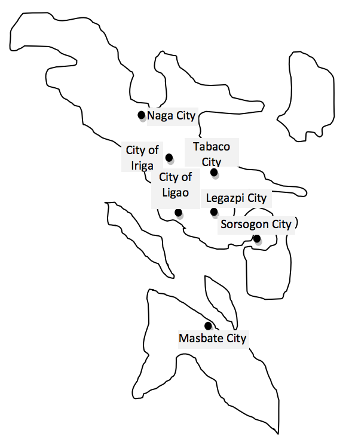

## 문제

The Bicol region (Region 5) is composed of six provinces. They are Albay, Camarines Norte, Camarines Sur, Sorsogon and the island-provinces of Catanduanes and Masbate. The cities in the Bicol region are Iriga City, Legazpi City, Ligao City, Masbate City, Naga City, Sorsogon City, and Tabaco City.

Figure H-1: Map of Bicol Region (Location are for illustration purposes only)

Most of the contestants could not wait to complete the competition and had begun planning on exploring the region. They had started asking where certain places were and are in the process of listing down the relative location between places.

## 입력

The input contains several test cases. Each test case contains two data sets. The first data set describes the relative location of the first place to the second, and the second data set contains queries on the relative location of the first place to the second.

Data set 1 is composed of a set of city pair values and a relative location. Each entry indicates that relative location of place 1 to 2. For instance, the entry (Naga City, City of Iriga, Northwest) means that the Naga City is northwest of City of Iriga. However, the data set will not have reverse relationship entry. For instance, (City of Iriga, Naga City, Southeast)

The data starts with two integers, m and n, representing the number of entries in data sets 1 and 2 respectively, where (1 ≤ m ≤ 100) and (1 ≤ n ≤ 50). This is followed by m entries of position description and n entries of queries.

The data entries are comma delimited and may contain mixed cases. The allowed relative positions are north, south, east, west, northeast, northwest, southeast and southwest. It is assumed that the each individual relative position has a value of 1. These are 1 north, 1 south, 1 east, 1 west, 1 north and 1 east, 1 north and 1 west, 1 south and 1 east, and 1 south and 1 west respectively. Thus, the distance from Masbate City to Naga City is the same as Sorsogon City to Legazpi City.

There is a blank line between test cases and the last test case is followed by a single integer zero.

## 출력

For each test case, output the relative position of the places being queried. The system will output “Relative location cannot be determined” if there is insufficient information; however the system should attempt to use all necessary information to obtain a result.
