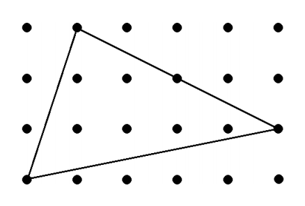

## 문제

A lattice point is a point whose coordinates on a rectangular coordinate system are integers. An interior lattice point is a lattice point that is inside a given polygon and not on its boundary. For example, the drawing below shows a triangle having six interior lattice points.

Write a program that reads an input containing three pairs of coordinates (xA, yA), (xB, yB), (xC, yC), where each coordinate is an unsigned integer with a value less than or equal to 100. The numbers in the line are separated exactly by one space and are in the order xA yA xB yB xC yC. The coordinates describe three distinct (but possibly collinear) lattice points. If the given coordinates describe a triangle with non-zero area, then the program should display on the screen the number of interior lattice points of the triangle. Otherwise, the program should display on the screen the number zero. (If the three points are collinear, then there are no interior lattice points.)

## 입력

The input starts with an integer N (0 ≤ N ≤ 255). This is followed by N input cases. Each input case is a list of six unsigned integers with values not exceeding 100. The six integers xA yA xB yB xC yC correspond to the coordinates (xA, yA), (xB, yB), (xC, yC).

## 출력

For every input case, print the number of interior lattice points in one line.
