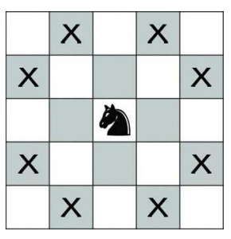

## 문제

In Chess, a knight can move two squares in one direction and then one in a perpendicular direction. It can ‘jump’, meaning that it only requires that the destination square be open - the path between can be occupied. In this diagram, the knight could move to any of the Xs.

Given a grid, a starting point and destination point, determine the least number of moves the knight must make to get from the start to the destination. Some squares of the grid may be occupied, so that the knight cannot move there.

## 입력

Each input will consist of a single test case. Note that your program may be run multiple times on different inputs. Each test case will begin with two integers n and m (2≤n,m≤100), indicating the height and width of the grid. Each of the next n lines will hold m characters, representing the grid. The grid will consist only of ‘.’ (open square), ‘#’ (occupied square), ‘K’ (the knight’s starting position) or ‘X’ (the knight’s destination). There will be exactly one ‘K’ and exactly one ‘X’ in each test case.

## 출력

Output a single line with a single integer indicating the minimum number of moves the knight needs to get to the destination, or -1 if the knight cannot make it. Output no spaces.
