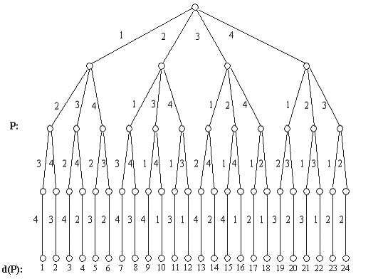

## 문제

Write a program that gives us the ordinal position d(P) of any rank-n permutation P=(p1,p2卲n) in the dictionary without producing all the rank-n permutations in order, where pi{1,2,3,...,n},n<=50. When n=4, the whole rank-4 permutation in lexicographical order and the code is shown in the following figure.

For example: if P=(2,3,4,1), then d(P)=10; if P=(4,2,1,3), then d(P)=21.

Rank - 4

Dictational Permutation

## 입력

(n, P): For more than one input in the input file, one line is for each input ,with -1 at the end. P is in the form of list.

## 출력

d(P): It should be in the form of a line with the outputs separated by commas.
