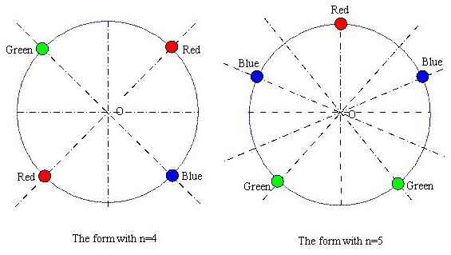

## 문제

Beads of red, blue or green colors are connected together into a circular necklace of n beads ( n < 24 ). If the repetitions that are produced by rotation around the center of the circular necklace or reflection to the axis of symmetry are all neglected, how many different forms of the necklace are there?

## 입력

The input has several lines, and each line contains the input data n. -1 denotes the end of the input file.

## 출력

The output should contain the output data: Number of different forms, in each line correspondent to the input data.
