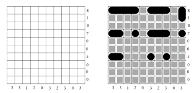
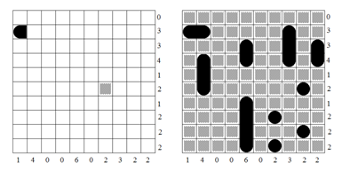
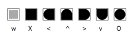

## 문제

You are all probably familiar with the pen and paper version of Battleships, but humor us while we describe it: Each puzzle consists of a 10-by-10 grid of squares in which 10 different ships have been secretly placed. One of these ships is 4 grid squares long, two of them are 3 grid squares long, three of them are 2 grid squares long, and the remaining four ships are each 1 grid square in length. No two ships can overlap and none can be adjacent to another, even diagonally. The only clues you have to the ship locations are a set of row and column sums printed on the left and bottom of the grid. Each row/column sum specifies how many grid squares in that row/column are occupied by ships. The figures below show an example of a Battleships puzzle and its solution.



Figure 1

When designing a Battleships puzzle, you must make sure that there is a unique solution for the given row and column sums. Sometimes the sums on the sides are all that are needed to ensure a unique solution (like the example above), but sometimes you must specify one or more squares in the grid in order to rule out all but one solution (as in the example below).



Figure 2

These specified squares can be one of seven types: water, interior of a ship, left end of a horizontal ship, top end of a vertical ship, right end of a horizontal ship, bottom end of a vertical ship, and 1-square ship. These are shown at the top of the next page. The characters beneath each square will be used for your output. Note that the last character is an upper-case letter ‘O’, not a zero; also note that the ‘X’ is upper-case but the ‘w’ and ‘v’ are lower-case.



Figure 3

Your job is the following: given a set of row and column sums, you are to find the minimum number of specified squares needed to ensure that there is a unique solution. If this number is greater than 2, you are to reject the puzzle as being too ambiguous.

## 입력

The input file will start with an integer n indicating the number of test cases. Each test case consists of two lines, the first containing the ten row sums and the second containing the ten column sums.

## 출력

For each test case, output the case number followed by the total number of solutions possible for the given row and column sums (this number will never exceed 12,000) followed by the minimum number of specified squares needed to force a unique solution. If this number is greater than 2, display the phrase

```

too ambiguous
```

Otherwise, output the location of the “best” square(s) that can be used to force a unique solution followed by the type of square to use, using the characters shown in Figure 3. In the case of a single square, the “best” square is the square with the lowest row number, breaking any ties by choosing the one with the lowest column number. After this, if there is a choice between the type of square to use, use the lexicographically first one, where the lexicographic ordering is shown in Figure 3, with “water” being the lexicographically first square type, followed by “interior of ship”, etc. In the case of two squares, output the pair whose first square is the best among all first squares, breaking ties by choosing the one with the best second square. All row and column numbers start at 1.
