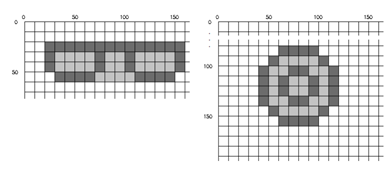
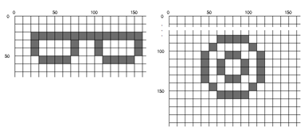

## 문제

Harriet T. Emmel is selling “real estate” on her web site in the form of 10-by-10 square blocks of pixels. She has divided her web page into a rectangular grid, with grid lines 10 pixels apart. Anyone may rent 10-pixel-by-10-pixel blocks in this grid for posting artwork, advertising, or anything else.

Harriet expected that most customers would want to purchase rectangular regions of blocks, but a few want to be more creative. For instance, an optician wanted to purchase blocks in the shape of a pair of eyeglasses and a bow-and-arrow company wanted to rent space in the shape of a bullseye (in the following, each square is a 10-pixel-by-10-pixel block):

Figure 1

Harriet has decided that, in the interests of simplicity, each purchase must be a single “orthogonally convex” region of blocks. This simply means that any row or column of pixels, when intersected with the region, must consist of either zero or one connected segments. For the two examples above, the smallest orthogonally convex regions containing the desired blocks are:

Figure 2

As a service to her customers, H. T. Emmel lets them choose any set of blocks, then she calculates the smallest orthogonally convex region containing them. Although, in general, this calculated region might be disconnected, we assume, for simplicity, that it is connected, i.e., that there is an orthogonal path of pixels connecting any pair of pixels in the region. Write the program that does this smallest region calculation.

## 입력

Each test case will consist of a line containing a positive integer n, n ≤ 10000, indicating the number of 10-pixel-by-10-pixel blocks requested by the user, followed by one or more lines containing a total of 2n integers r0 c0 r1 c1 . . . rn−1 cn−1, 0 ≤ ri, ci ≤ 109. Each ri ci pair gives the row and column number of the upper left pixel of one of these blocks. All of these coordinates will be multiples of 10 and no coordinate pair will be repeated withing a test case. Each test case is guaranteed to be covered by a single, connected, minimal, orthogonally convex polygon. A line containing a single 0 will terminate input.

## 출력

For each test case, print the case number followed by the (row, column) pixel coordinates of the vertices of the smallest orthogonally convex polygon containing the blocks described by the input. The first coordinate should be for the block with the lowest row number and, among those, the lowest column number. The coordinates should describe a clockwise traversal of the polygon.
