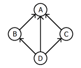

## 문제

Phyllis works for a large, multi-national corporation. She moves from department to department where her job is to uncover and remove any redundancies inherent in the day-to-day activities of the workers. And she is quite good at her job.

During her most recent assignment, she was given the following chart displaying the chain of command within the department:

Figure 1

Whenever anyone needs to send a report to their bosses, they use the above chart, sending one report along each arrow. Phyllis realized almost instantly that there were redundancies here. Specifically, since D sends a report to B and B sends a report to A, there’s really no need for D to send a report to A directly, since it will be summarized in the report B sends to A. Thus the connection from D to A can be removed. If there had also been a connection from C to B, then the connections from D to B and C to A could have been removed as well.

Phyllis would like your help with this. Given a description of a chart like the one above, she would like a program that identifies all connections that can be removed from the chart.

## 입력

The first line of each test case will contain a positive integer m indicating the number of connections in the chart. Following that will be m lines each containing two strings s1 s2 indicating that there is a connection from employee s1 to his/her boss s2. In any test case there will be no more than 200 employees listed and no connection will appear more than once. A line containing a single 0 will terminate the input.

## 출력

For each test case, output the number of connections that should be removed followed by a list of the deleted connections in lexicographic order. Connection s1 s2 should be represented by the string `s1,s2`.
