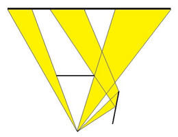

## 문제

Arbor Day is a big day for the Pine Family of Chestnut Grove. Each year the family, led by their dad Hickory, decorates their front yard and the front of their house with hundreds of Arbor Day decorations. At night, Hickory likes to shine a yard light onto the front of the house so that the passing onlookers can get a better look at all the displays. Unfortunately, several of the decorations block the light, making it difficult to shine a light on the entire house. This is mitigated a bit by the fact that some of the decorations act like mirrors and can reflect the light onto the house. The figure below shows an example: the light emanates from a point at the bottom of the figure, and is blocked by the horizontal decoration in the middle of the figure, but gets reflected by the other decoration on the right. As a result, only about 75% of the front of the house (at the top of the figure) gets illuminated.

Figure 1

Since their Arbor Day decorations change from year to year, Hickory would like a general method to determine what percent of the front of his house will be lit given a layout of the decorations and whether they reflect or not.

## 입력

Each test case will start with a line containing three values: an integer n, a double ang and a double len. n specifies the number of decorations (0 ≤ n ≤ 10), and ang represents the spread of the light in degrees (0 < ang ≤ 150). The light is always located at the origin, and the beam of light is symmetric about the positive y-axis, making an angle of ang/2 on either side. len specifies the maximum distance any light ray can travel (after this distance, the beam is diminished enough so that it does not contribute to the lighting of the house). The next n lines will each contain 5 integers x1 y1 x2 y2 r, where the first four values specify the endpoints of a decoration, and r will be either 0 for a non-reflective decoration or 1 for a reflective decoration. Assume all decorations have 0 thickness and that a reflective decoration is reflective on both sides. Following these n lines will be a single line containing 4 integers x1 y x2 y specifying the endpoints of the house front, with y > 0. None of the decorations will intersect with each other, the house front or the origin, and none will have y values greater than the y value for the house front. All coordinates will be between -10000 and 10000. For each test case, the placement of the decorations and the value of len will ensure that the total number of beam reflections is no more than 100. A line containing 0 0.0 0.0 will terminate input.

## 출력

For each test case, output the percentage of the house illuminated, rounded to the nearest hundredth.
