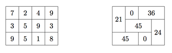

## 문제

The Acme Consulting Group has sent you into a new technology park to enhance dynamism, synergy and sustainability. You’re not sure what any of these terms mean, but you’re pretty good at making money, which is what you plan on doing. The park consists of a 3 × n grid of facilities. Each facility houses a start-up with an inherent value. By facilitating mergers between neighboring start-ups, you intend to increase their value, thereby allowing you to fulfill your life-long dream of opening your own chain of latte-and-burrito shops.

Due to anti-trust laws, any individual merger may only involve two start-ups and no start-up may be involved in more than one merger. Furthermore, two start-ups may only merge if they are housed in adjacent facilities (diagonal doesn’t count). The added value generated by a merger is equal to the product of the values of the two start-ups involved. You may opt to not involve a given start-up in any merger, in which case no added value is generated. Your goal is to find a set of mergers with the largest total added value generated. For example, the startup values shown in the figure on the left, could be optimally merged as shown in the figure on the right for a total added value of 171.

## 입력

The first line of each test case will contain a single positive integer n ≤ 1000 indicating the width of the facilities grid. This is followed by three lines, each containing n positive integers (all ≤ 100) representing the values of each start-up. A line containing a single 0 will terminate input.

## 출력

For each test case, output the maximum added value attainable via mergers for that set of start-ups.
