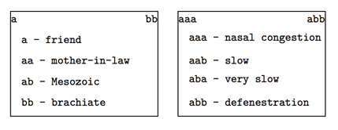

## 문제

It’s 2014, and Bob Roberts is an expert linguist and world renowned expert on the language of the alien M’ca. Their language is rather unusual in that all the words are made up of the letter combinations “a”, “ab” and “bb” (we’re using ‘a’s and ‘b’s here, since the actual M’ca characters are unprintable). Thus, some words in their language are aaabbbbb and aababb, but babb is not (you’d be a laughingstock in any M’ca establishment if you tried to used babb in a sentence). Not surprisingly, with such a small alphabet, every possible combination of “a”, “ab” and “bb” form a legal M’ca word (up to a certain length, which is of no importance to this problem). Bob is creating a set of M’ca-to-English dictionaries of all legal M’ca words and is following the traditional word ordering of the M’ca: all 1 letter words are listed first (in alphabetical order), then all 2-letter words (in alphabetical order), and so on. The first two pages of one possible dictionary are shown below:

Bob needs a little help. He intends for each page of any dictionary to contain the same number of M’ca words, but this number will vary in different editions depending on the page size, font size, etc. As with any dictionary, the first and last word of each page is printed at the top of the page to allow easier searching by users. Here’s where you come in: given the number of words per page, and the page number, he would like a program to determine the two words printed at the top of that page.

## 입력

Input for each test case will consist of a single line containing two positive integers n m, where n is the number of words per page (≤ 30) and m is the page number (m ≤ 1018). A line containing 0 0 will terminate input.

## 출력

For each test case output the two words which would appear at the top of page m given that n words are printed on each page (including page m).
