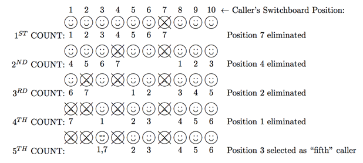

## 문제

A local radio station is holding a phone-in contest, and deejay J-Z Phus is in charge of administering the contest. He goes on the air at random times and announces things like “The fifth caller will get a chance for the grand prize.” At this point, the switchboard lights up with dozens of callers. All these callers show up on a monitor in front of J-Z numbered 1, 2, 3, etc. J-Z could just pick caller number 5 at this point, but since he figures that everyone basically called in at the same time, he has decided on a different method. He picks a random number – say 7 – and then starts eliminating every seventh caller. If he hits the end of the switchboard while counting, he cycles back to the beginning, but once a caller is eliminated, their position is no longer used in the count. After eliminating 4 callers, he moves down 7 more positions and obtains his “fifth” caller. The figure below show how this would work if J-Z’s switchboard held 10 callers. In this case, the caller in position 3 is selected as the “fifth” caller.

Of course, the choice of “fifth” caller, the number of callers, and the use of the number 7 can change from call-in to call-in. You are to write a general program to determine which caller is selected given all of the pertinent information.

## 입력

Each test case will consist of a single line containing 3 positive integers n m k, where n is the number of callers on the switchboard, and m is the number of positions J-Z skips over each time until he gets to the kth caller. The value of n will always be ≥ k. In the above example, n = 10, m = 7 and k = 5. The maximum value for any of these values is 200. A line containing three zeros will terminate input.

## 출력

For each test case, output the position of the caller chosen as the kth caller.
