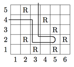

## 문제

Sylvester Stallion is an old horse who likes nothing better than to wander around in the fields around his stable. Sylvester is a little single minded and will walk in a straight line unless there is a rock in this path. If that’s the case, he does one of three things: 1) if there is no rock to his right, he turns right and continues walking straight in that direction; 2) otherwise, if there is no rock to his left, he turns left and walks in that direction; 3) otherwise, he turns around and walks back the way he came. In a particularly rocky field, he may make several turns in his walk and exit the field in quite an unexpected location. For example, in the field shown below, if Sylvester enters the field at square (1,4), he will follow the path shown (a total of 12 squares), exiting at square (3,5).

Many of his other animal friends are concerned about Sylvester, and would like to know where he ends up on his walks (in particular, his good friend, the ram Beau). That’s where you come in – given a description of a field and the location of Sylvester’s entrance, you are to determine where he will exit the field and how long it will take him to get there.

## 입력

Each case starts with three positive integers n m r indicating the number of columns (n) and rows (m) in the field and the number of rocks (r), with n, m ≤ 20. Following the first line will be lines containing the locations of the r rocks. Each location will be of the form c r, indicating the column and row of the rock. There will be no more than 1 rock in any location. Following the rock locations will be the entrance location for Sylvester. Sylvester’s starting direction will always be perpendicular to the side of the field he enters from (this location will never be a corner square) and there will never be a rock in his entrance location square. A line containing three zeros will terminate input.

## 출력

For each test case, output the case number followed by the last square Sylvester hits before he leaves the field (Sylvester will never get trapped in any field) and the number of squares that Sylvester visited during his walks, counting repeated squares.
