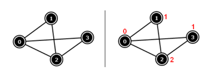

## 문제

정점 V개와 간선 E개로 이루어진 무방향 그래프 G가 주어졌을 때, G의 각 정점에 번호를 붙이는 프로그램을 작성하시오. 번호는 0보다 크거나 같고, X보다 작은 정수이어야 하며, 한 간선의 양 끝점이 같은 번호이면 안 된다. 이때, X는 가능한 작아야 한다.

## 입력

첫째 줄에 V와 E가 주어진다. 다음 E개 줄에는 간선 (a, b)을 나타내는 a b가 주어진다. 입력은 다음과 같은 제한을 갖는다.

1. 70 < V < 1000
2. 1500 < E < 106
3. 모든 간선 (a, b)에 대해서 a ≠ b, 0 ≤ a < V, 0 ≤ b < V. 같은 간선이 여러 번 주어질 수 없다.

## 출력

첫째 줄에 가장 작은 X를 출력한다. 다음 줄에는 0번 정점부터 V-1번 정점에 붙인 수를 공백으로 구분하여 출력한다. 마지막 줄에는 counter 변수를 출력한다.

## 힌트

