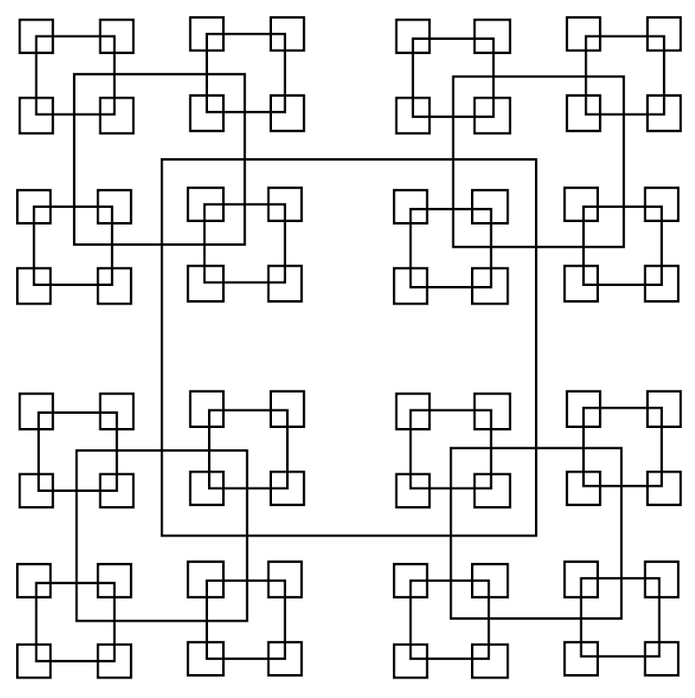

## 문제

Geometrically, any square has a unique, well-defined centre point. On a grid this is only true if the sides of the square span an odd number of points. Since any odd number can be written in the form 2k+1, we can characterise any such square by specifying k, i.e. we can say that a square whose sides are of length 2k+1 has size k. Now define a pattern of squares as follows.

1. The largest square is of size k (i.e. sides are of length 2k+1) and is centred in a grid of size 1024 (i.e. the grid sides are of length 2049).
2. The smallest permissible square is of size 1 and the largest is of size 512, thus 1 ≤ k ≤ 512.
3. All squares of size k > 1 have a square of size k / 2 centred on each of their 4 corners. (Integer division, thus 9 / 2 = 4).
4. The top left corner of the grid has coordinates (0,0).

Hence, given a value of k, we can draw a unique pattern of squares according to the above rules, e.g., if k is 15, then the following pattern would be produced.

Obviously, any point in the grid will be surrounded by zero or more squares. (If the point is on the border of a square, it is considered to be surrounded by that square).

Write a program that will read in a value of k and the coordinates of a point, and will determine how many squares surround the point.

## 입력

Input will consist of a series of lines containing 3 integers (k and the coordinates of the point) terminated by a line consisting of three zeroes (0 0 0).

## 출력

Output will consist of a series of lines, one for each line of the input. Each line will consist of the number of squares surrounding the specified point.
