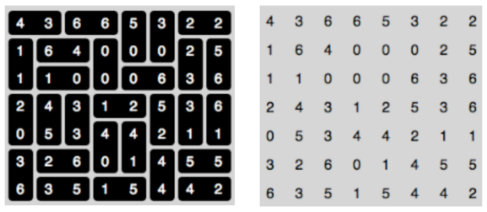

## 문제

A set of dominoes, that is, one instance of every unordered pair of the numbers from 0 to n, has been arranged irregularly into a rectangle and the pattern has been recorded by writing the number in each square. For instance, in the figure below the original layout, using a 'standard' set (n = 6) of dominoes, is on the left and the puzzle configuration is on the right. Write a program to recreate the original configuration, guaranteed to exist and to be unique.

## 입력

Input will consist of a series of puzzles. Each puzzle will start with a line containing an integer n (2 ≤ n ≤ 12). Following this will be n rows each containing n+1 characters from the first n+1 letters of the lower case alphabet, separated by single spaces. The set of puzzles will be terminated by a line containing a single zero (0). The above puzzle is represented in this form in the sample input.

## 출력

Output will consist of a representation of the original grid in the same format as the input, except that a pair of letters constituting a horizontal domino are separated by an equals sign (‘=’), as shown in the sample output below. Leave a blank line between successive grids.
