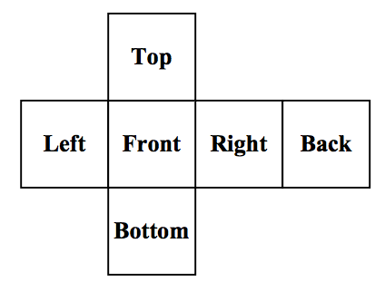

## 문제

The Rubik’s Cube was invented by Enro Rubik in 1974. It is a 3-dimensional puzzle made up of 26 smaller cubes. Each smaller cube has from one to three sides exposed for a total of 54 exposed sides. Each of these sides is assigned one of six colors, and each color is assigned to precisely nine exposed sides. The cube is manipulated by rotating any side of the cube by 90 degrees. It is considered solved when each side of the Rubik’s Cube is entirely covered by one of the six colors.

You are a researcher at the Rubik’s University and are working on an algorithm to solve a Rubik’s Cube in the least possible number of moves from any starting position. To aid in your research, you need a program that will read in various Rubik’s Cube configurations, perform operations on those configurations, and determine if the resulting cube is solved.

## 입력

Input to this problem will consist of a starting configuration for the Rubik’s Cube and then one or more operations to perform on the cube.

The input configuration will look like:

```

      G W O
      G R R
      G B R
B R B R G Y W W W Y G O
G W B O G B Y B O W Y O
W R Y O Y B R Y R G O O
      B R Y
      B O W
      G Y W
```

Which follows this layout:



Each character in this grid represents the color of the piece of the cube. There is one space between each character in the grid and possibly many spaces before the first character on a line. The grid represents the cube as is if it were unfolded and flattened out. Each group of 9 characters (3 x 3 array) represents one side of the grid. The top of the cube is represented by the first 3 lines of input. The next 3 lines of input represent the left, front, right, and back sides in that order. The last 3 lines represent the bottom of the cube.

Following the initial configuration will be 1 more operations to perform on the cube. There are 12 possible operations that can be performed, each being a 90 degree rotation of one of the cube’s ‘faces’ of 9 smaller cubes. Note that this results in the movement of 20 colored squares (8 on the face being rotated and 12 on the sides of the smaller cubes that make up that face). All 12 possible operations are listed in the table below with a description of how to perform that operation.

Input to this problem will consist of a (non-empty) series of up to 100 data sets. Each data set will be formatted according to the following description, and there will be no blank lines separating data sets.

There will be one or more data sets. A single data set has 2 components:

1. Start line - A single line, “START”.
2. An initial configuration of the cube (9 lines total)
3. One or more operations each on a separate line
4. End line – A single line, “END”.

Following the final data set will be a single line, “ENDOFINPUT”.

| Operation | Description |
| --- | --- |
| front left | Performed by rotating the front side counter-clockwise when viewing from the front |
| front right | Performed by rotating the front side clockwise when viewing from the front |
| left left | Performed by rotating the left side counter-clockwise when viewing from the left |
| left right | Performed by rotating the left side clockwise when viewing from the left |
| right left | Performed by rotating the right side counter-clockwise when viewing from the right |
| right right | Performed by rotating the right side clockwise when viewing from the right |
| back left | Performed by rotating the back side counter-clockwise when viewing from the back |
| back right | Performed by rotating the back side clockwise when viewing from the back |
| top left | Performed by rotating the top side counter-clockwise when viewing from the top |
| top right | Performed by rotating the top side clockwise when viewing from the top |
| bottom left | Performed by rotating the bottom side counter-clockwise when viewing from the bottom |
| bottom right | Performed by rotating the bottom side clockwise when viewing from the bottom |

## 출력

For each data set, there will be exactly one line of output. If the cube is solved, then the word “Yes” is output on a line. If the cube remains unsolved, then the word “No” is output on a line.
