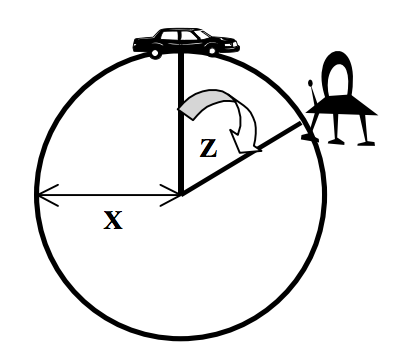

## 문제

You are a intrepid 2-dimensional explorer located at the northern polar reaches of a distant 2-dimensional planet. Unfortunately, you have been assigned to explore the most boring planet in the known universe (due primarily to your lack of social skills and aggressive body odor). Having a perfectly circular surface, your planet holds no surprises for a would-be explorer.

However, you have recently received a distress call from an alien ship which has crash-landed somewhere on the surface of your planet. Unfortunately, you designed your own equipment, and the only information it will give you is an angle (measured from the center of the planet) separating you from the crash site.

Using this information along with how much gasoline is available for your planet-rover (which gets a measley 5 miles per gallon), you have to determine if you can possibly get to the crash site and back without running out of fuel.

## 입력

Input to this problem will consist of a (non-empty) series of up to 100 data sets. Each data set will be formatted according to the following description, and there will be no blank lines separating data sets.

A single data set has 3 components:

1. Start line – A single line, “START”.
2. Input line – A single line, “X Y Z”, where:
   * X : (1 <= X <= 100) is the radius of your planet in integer miles
   * Y : (0 <= Y <= 100) is the amount of gasoline in your planet-rover in integer gallons
   * Z : (0 <= Z <= 360) is an angle separating you from the crash site in integer degrees
3. End line – A single line, “END”.

Following the final data set will be a single line, “ENDOFINPUT”.

Take note of the following:

* The circumference of a circle in terms of its radius, r, is known to be 2πr
* Assume that π = 3.14159

## 출력

For each data set, there will be exactly one line of output. If you have enough fuel to get to the crash site and back, the line will read, “YES X”, where X is the amount of fuel you will have left expressed as an integer number of gallons (truncate any fractional gallons). If you do not have sufficient fuel, the line will read, “NO Y”, where Y is the distance you can travel expressed as an integer number of miles.
