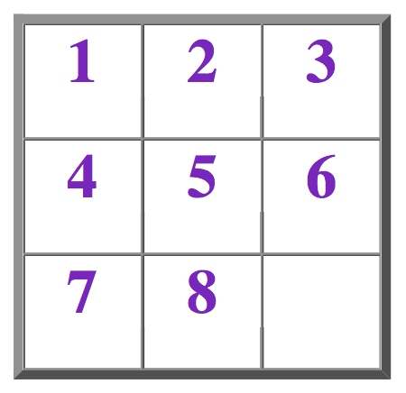

## 문제



Remember those wacky number puzzles you used to win at birthday parties as a kid? Well, they're back, but this time with a digital twist. As with everything else, kids today are spoiled, having access to technology to make things easier for them. And why should games be any different?

With this in mind Wiltin' Badley has decided to release a 21st Century version of this old puzzle favorite and call it Missing Piece 2001. Since this is a modern version of the game, it will be accompanied with a software supplement to give the player an idea of the skill level necessary to solve the puzzle. The software supplement will allow the player to enter in the initial board configuration along with the expected final board configuration, and the software will tell the player whether it is solvable within a certain number of moves. If the puzzle is solvable within the selected number of moves, the software will then give the optimal number of moves necessary to solve the puzzle. You have been hired by Wiltin' Badley as a Software Engineer to write this very software.

As with any good software, the ability of your software to be flexible is a must. Therefore, you are to design this software to allow the user to enter the dimensions of the game board, the desired number of moves in which the puzzle is to be solved, the initial board configuration, and the final board configuration. This user input will take into account different game board sizes (different-sized game boards sold separately, for a nominal fee of course), different number of moves necessary to solve the puzzle (so the player can tell if the puzzle is solvable given his/her skill level), as well as any solution set the player may want to try.

Game Piece Movement

A valid move consists of moving a game piece (number) which is adjacent to the missing piece ('X') in the direction of the missing piece. Note that only game pieces that are adjacent to the missing piece may be moved, and the only valid directions of movement are UP, DOWN, LEFT, or RIGHT (depending on the placement of the game piece in relation to the missing piece).

## 입력

Input to this problem will consist of a (non-empty) series of up to 10 data sets. Each data set will be formatted according to the following description, and there will be no blank lines separating data sets.

Each data set consists of 4 components:

1. Start Line - A single line, "START D N", where 3 <= D <= 10 and 0 <= N <= 15
2. Initial Board Layout - Consists of a D x D matrix of integers ranging from 1 to (D2 - 1) inclusive (where D is the Board Dimension), and an 'X' to denote the missing piece. This matrix represents the layout of the game board prior to the solution attempt.
3. Solved Board Layout - Consists of a D x D matrix of integers ranging from 1 to (D2 - 1) inclusive (where D is the Board Dimension), and an 'X' to denote the missing piece. This matrix represents the final layout of the game board necessary to successfully solve the puzzle.
4. End Line - A single line, "END"

Notes:

* On the "Start" line of the data set, D represents the dimensions of the puzzle board.
* On the "Start" line of the data set, N represents the number of moves the player wants to be able to solve the puzzle within.
* Both game board layout matrices will contain ALL numbers within the range mentioned above (inclusive), with no missing or repeated numbers, and one 'X' (missing piece).

## 출력

For each data set, there will be exactly one output set, and there will be a single blank line separating output sets.

An output set consists of a string telling the player whether the puzzle is solvable within the number of moves specified in the input, along with the optimal number of moves necessary to obtain the Solution Board Layout if the puzzle is solvable within the number of specified moves. If the puzzle is not solvable within the specified number of moves, the number of specified moves is echoed back to the output. The output for each data set will consist of a single line, specified by the following format:

```

<Answer String> "WITHIN" [Number Moves] "MOVES"
```

Notes:

IF the puzzle is able to be solved within the specified number of moves:

```

Answer String = "SOLVABLE"
Number Moves = <An integer representing the optimal number of moves>
```

ELSE

```

Answer String = "NOT SOLVABLE"
Number Moves = <An integer representing the number of moves specified as input>
```
